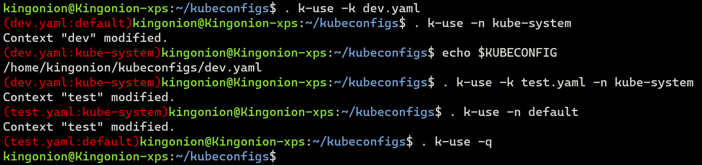

# `k-use`: A script that helps you switch `kubeconfig` and `namespace` quickly

You may need to type many words to switch the `kubeconfig` and `namespace`. With this script, you can enjoy following stuffies.

* type fewer words when switching `kubeconfig` and `namespace`
* use `kubeconfig` with relative path without worrying switching directories
* show you the `kubeconfig` file name and `namespace` in the shell prompt

Here is a simple demo.



## Installing
1. Clone this repository
2. Copy `k-use` to somewhere in your `PATH`

## Usage
```text
. k-use [-h] | [-q] | [-k kubeconfig] [-n namespace]
```
